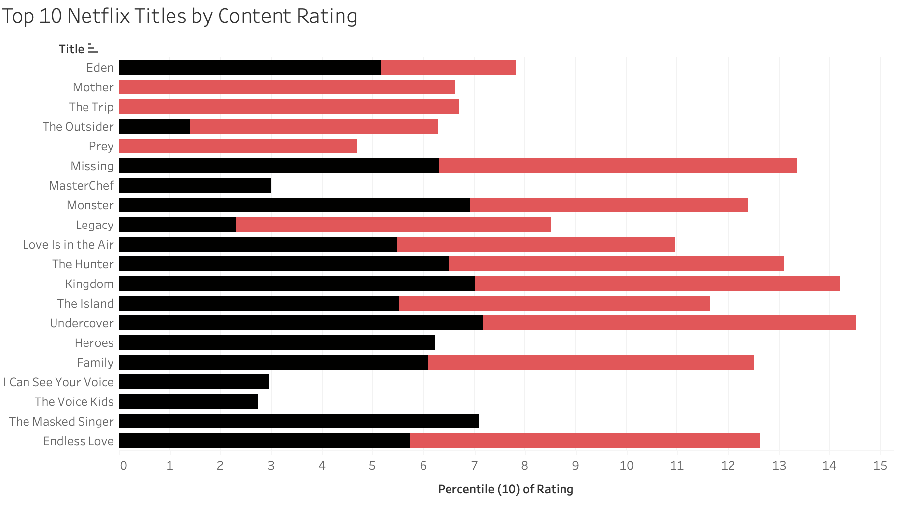
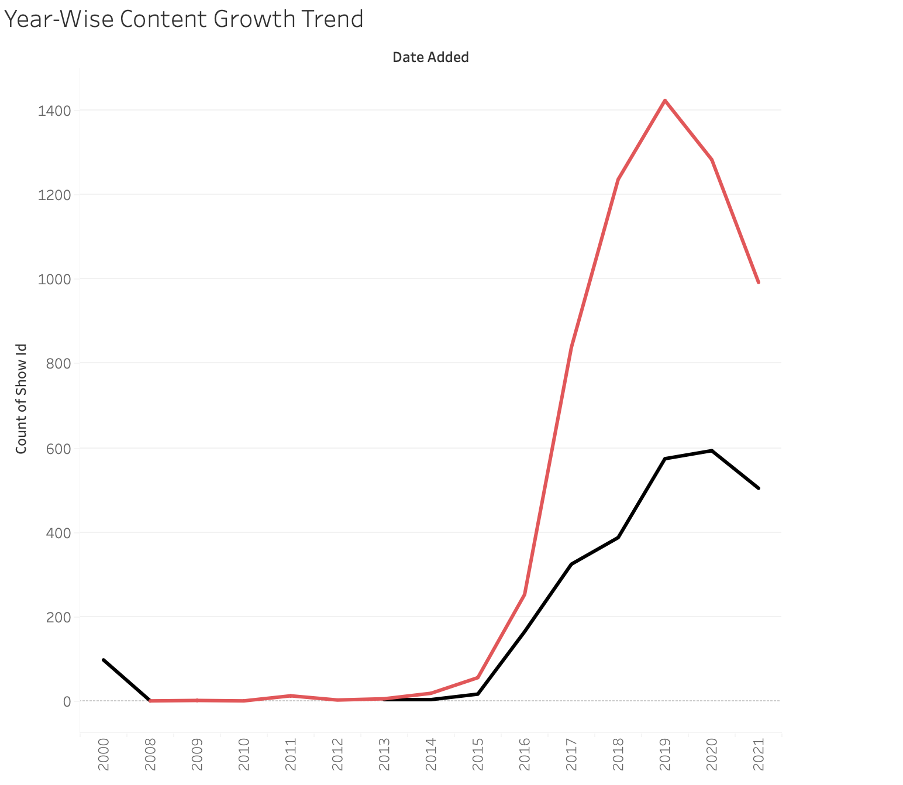
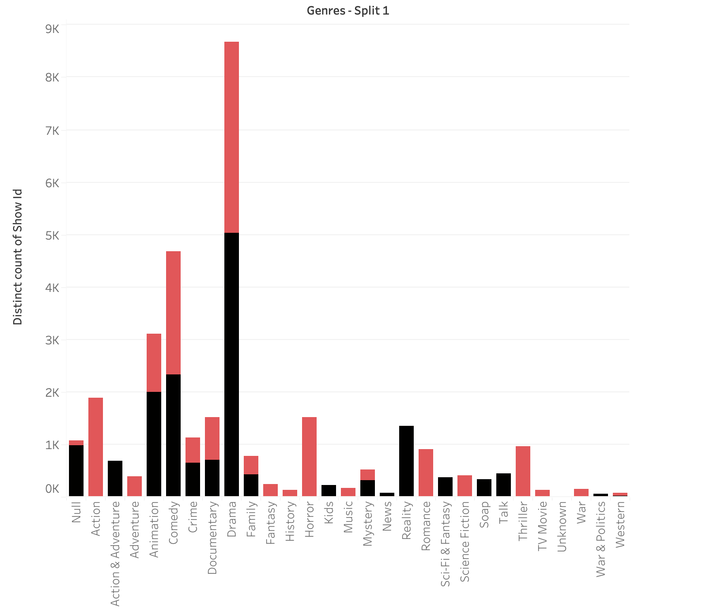
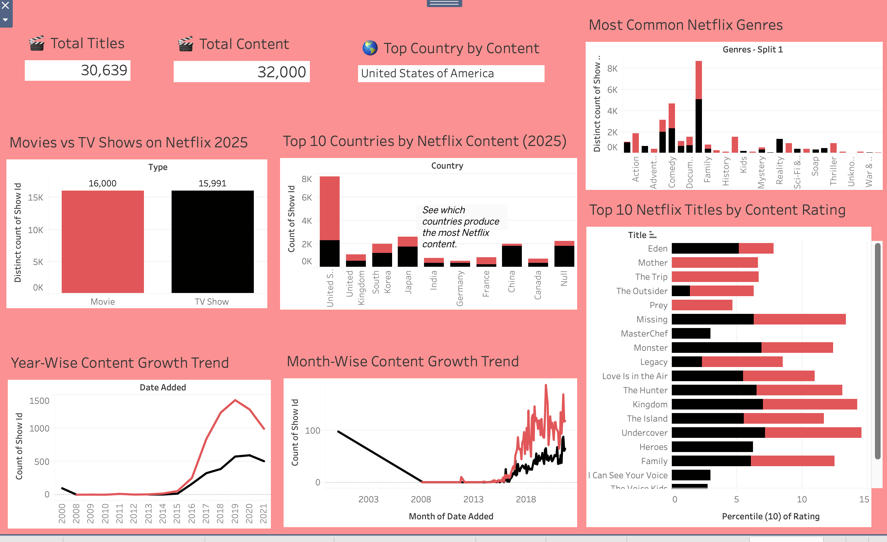

# 📺 Netflix 2025 Analytics Dashboard

A comprehensive Tableau dashboard analyzing Netflix content up to 2025. Visualizes trends, top countries, popular genres, and more.  

---

## 🗂 Project Overview

This project uses **Netflix Movies and TV Shows datasets (2025-ready)** to create interactive visualizations in Tableau.  
The goal is to provide insights into Netflix’s library growth, content distribution, and audience preferences.

---

## 📊 Dashboard Highlights

### 1️⃣ Movies vs TV Shows
Shows the proportion of movies and TV shows in Netflix’s library.  

### 2️⃣ Top 10 Content-Producing Countries
Highlights which countries contribute the most content.  

### 3️⃣ Content Growth Trend
Tracks the number of releases added each year.  

### 4️⃣ Most Common Netflix Genres
Shows the most frequently listed genres.  

### 5️⃣ Dashboard 

## 🛠 Tools & Technologies

- **Data Analysis**: Python, Pandas  
- **Visualization**: Tableau 2025  
- **Version Control**: Git & GitHub  

---

## 📂 Project Structure
---

## 🔗 Project Link

Check out the full project on GitHub: [Netflix 2025 Dashboard](https://github.com/YashhCanCode/Netflix-Analysis)

---

## 📌 Insights

- Most of the content is produced by a few countries (top 10 dominate the library).  
- Genre preferences reveal a strong presence of [Action/Drama/Documentaries].  
- KPI cards provide quick, high-level metrics for business decision-making.  

---

## ✨ Future Work

- Add sentiment analysis of movie/TV show descriptions.  
- Include ratings and viewer reviews for deeper insights.  
- Build interactive filters for user-selected countries, genres, and release years.
